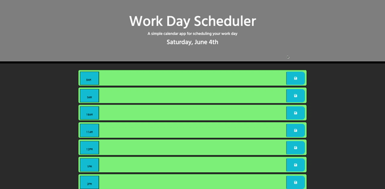

# Work Day Scheduler

## Description
* A simple calendar application that allows the user to save events for each hour of the day. 
    * Timeblocks change background color based on the time of day. 
        * Current hour - Red
        * Past hours - Grey
        * Future hours - Green

## Built With
* HTML
* CSS
* Bootstrap
* JavaScript
* jQuery
* Moment.js

## Website
https://jessica-calderon.github.io/work-day-scheduler/

## Website Preview

## Contribution
## Made with love by Jessica E. Calderon

## Additional Contribution
* Font Awesome Icons
* Google Fonts 

